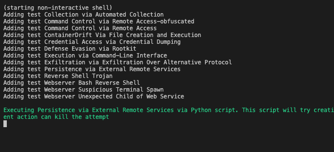

# CrowdStrike Docker Detection Container

[](https://quay.io/repository/crowdstrike/detection-container)

This container will create detections and preventions on a Linux container platform protected by a CrowdStrike sensor.

Automated detections currently available include:
| Name | Description |
|:-----|:------------|
| (Defense Evasion via Masquerading)[https://github.com/CrowdStrike/detection-container/blob/master/bin/Defense_Evasion_via_Masquerading.sh] | Creates a copy of `/usr/bin/whoami` to `whoami.rtf` and executes it, causing a contradicting file extension. |
| (Defense Evasion via Rootkit)[https://github.com/CrowdStrike/detection-container/blob/master/bin/Defense_Evasion_via_Rootkit.sh] | This script will change the group owner of `/etc/ld.so.preload' to '0', indicative of a Jynx Rootkit. |
| (Execution via Command-Line Interface)[https://github.com/CrowdStrike/detection-container/blob/master/bin/Execution_via_Command-Line_Interface.sh] | Emulate malicious activity related to suspicious CLI commands. Runs the command `sh -c whoami '[S];pwd;echo [E]'`.|
| (Exfiltration Over Alternative Protocol)[https://github.com/CrowdStrike/detection-container/blob/master/bin/Exfiltration_via_Exfiltration_Over_Alternative_Protocol.sh] | Attempts to exfiltrate data using DNS dig requests that contain system data in the hostname. |
| (Command & Control via Remote Access Protocol)[https://github.com/CrowdStrike/detection-container/blob/master/bin/Command_Control_via_Remote_Access.sh] * | Attempts to connect to a remote IP address and will exit at fork. Falcon Prevent will kill the attempt. |
| (Collection via Automated Collection) [https://github.com/CrowdStrike/detection-container/blob/master/bin/Collection_via_Automated_Collection.sh] | Attempts to dump credentials from `/etc/passwd` to `/tmp/passwords`. |
| (Credential Access via Credential Dumping)[https://github.com/CrowdStrike/detection-container/blob/master/bin/Credential_Access_Via_Credential_Dumping.sh] | Runs mimipenguin and tries to dump passwords from inside the container environment. |
| (Malware - Linux Trojan (local execution))[https://github.com/CrowdStrike/detection-container/blob/master/bin/Malware_Linux_Trojan_Local.sh] * | Attempts to execute malware pre-loaded into the container. A Falcon Prevent policy will kill the process, if Falcon Prevent is enabled. |
| (Malware - Linux Trojan (remote download))[https://github.com/CrowdStrike/detection-container/blob/master/bin/Malware_Linux_Trojan_Remote.sh] * | Downloads malware from a remote target and attempts to execute it. A Falcon Prevent policy will kill the process, if Falcon Prevent is enabled. |
| (Webserver Suspicious Terminal Spawn)[https://github.com/CrowdStrike/detection-container/blob/master/bin/Webserver_Suspicious_Terminal_Spawn.sh] | Executes a command injection, which writes a file to local webserver then executes that script. |
| (Webserver Unexpected Child of Web Service)[https://github.com/CrowdStrike/detection-container/blob/master/bin/Webserver_Unexpected_Child_of_Web_Service.sh] |Executes command injection to dump MySQL Server tables of database running inside the detection container. |
| (Webserver Bash Reverse Shell)[https://github.com/CrowdStrike/detection-container/blob/master/bin/Webserver_Bash_Reverse_Shell.sh] * | Executes command injection that creates a reverse shell over the web server running in the detection container. |
| (Webserver Trigger Metasploit Payload)[https://github.com/CrowdStrike/detection-container/blob/master/bin/metasploit/Webserver_Trigger_Metasploit_Payload.sh] ** | Simulates a malicious file upload, which executes a reverse TCP meterpreter to Kali. Please review the script for details on how to trigger this detection. |

(*) eligible for Prevention if configured in policy
(**) container starting using exposed port (-p 8080:80) required and a Kali attack host ready. Note a detection will only occur once you execute commands via meterpreter!

# Downloading & Usage

## Download via Quay.io
Container images hosted at [https://quay.io/repository/crowdstrike/detection-container](https://quay.io/repository/crowdstrike/detection-container) are automatically rebuilt with every merged pull request. Pull this container with the following Docker (or podman!) command:

Using Docker CLI:
```
$ docker pull quay.io/crowdstrike/detection-container
```

Using Podman CLI:
```
$ podman pull quay.io/crowdstrike/detection-container
```

## Build from Source
Clone this repository and build the container using ``docker build`` or ``podman build``:

With Docker CLI:
```
docker build -t <your_repository>/detection-container .
```

Podman CLI:
```
podman build -t <your_repository>/detection-container .
```

# Generate Sample Detections
The detection-container can used in one of two modes:

1. ``interactive`` mode, which will expose a TUI where you can select pre-canned scripts that will generate simple detections (e.g., "hit #1 for credential dumping!"). 

2. ``non-interactive`` mode, which will randomly create detections. This is how CrowdStrike runs the detection-container internally as it will constantly create sample detections for product demos.

## Interactive Mode
The following command will utilize Docker's interactive mode, present you with a text-based interface, and remove the container from your system after running:

```
$ sudo docker run --rm -it quay.io/crowdstrike/detection-container
```

This will present a text user interface:


Enter the menu option of the detection you would like to create and hit enter. Depending on which detection was selected you may be guided through additional menus.

## Non-interactive Mode
Non-interactive mode will randomly create detections. Between each detection the container will pause for a randomized amount of time ranging from 100 to 1800 seconds (roughly 1.5 - 30 minutes). This pause ensures events trigger unique detections in the Falcon console that are not grouped together.

The following command will run detection-container non-interactively:
```
$ sudo docker run --rm quay.io/crowdstrike/detection-container
```

Output will be sent to the console (via ``stdout``) regarding what detections are being generated. An example of running in non-interactive mode, plus output, is shown below:


